<a href="https://github.com/pedrovyg">
<picture>
<source media="(prefers-color-scheme: dark)" srcset="https://raw.githubusercontent.com/pedrovyg/pedrovyg/main/profile/neofetch-dark.svg">

</picture>
</a>

<br>


### Hi, I'm Pedro 

<p align="left">
  
</p>

Sou ```Desenvolvedor de Software```, com foco em **Front-End** e evolução contínua no ecossistema **Full Stack** por meio de tecnologias de **Back-end**.

Atualmente curso ```Ciência da Computação``` e desenvolvo projetos utilizando tecnologias web modernas e ferramentas voltadas ao desenvolvimento, versionamento, automação e conteinerização.

Também estudo e utilizo **Inteligência Artificial Generativa** como ferramenta de apoio ao desenvolvimento de software, prototipação, automação e criação de soluções mais eficientes.

<br>

<!-- Social -->

<div align="left">

  <a href="https://www.linkedin.com/in/pedrovygotsky" target="_blank">
    
  </a>

</div>

##

### Technologies & Tools

#### Front-End

[](https://skillicons.dev)

#### Back-End & Programming

[](https://skillicons.dev)

#### Development Tools

[](https://skillicons.dev)

#### Design

[](https://skillicons.dev)

##

<details>
<summary><strong>GitHub Stats</strong></summary>

<br>

<div align="left">


</div>

</details>
